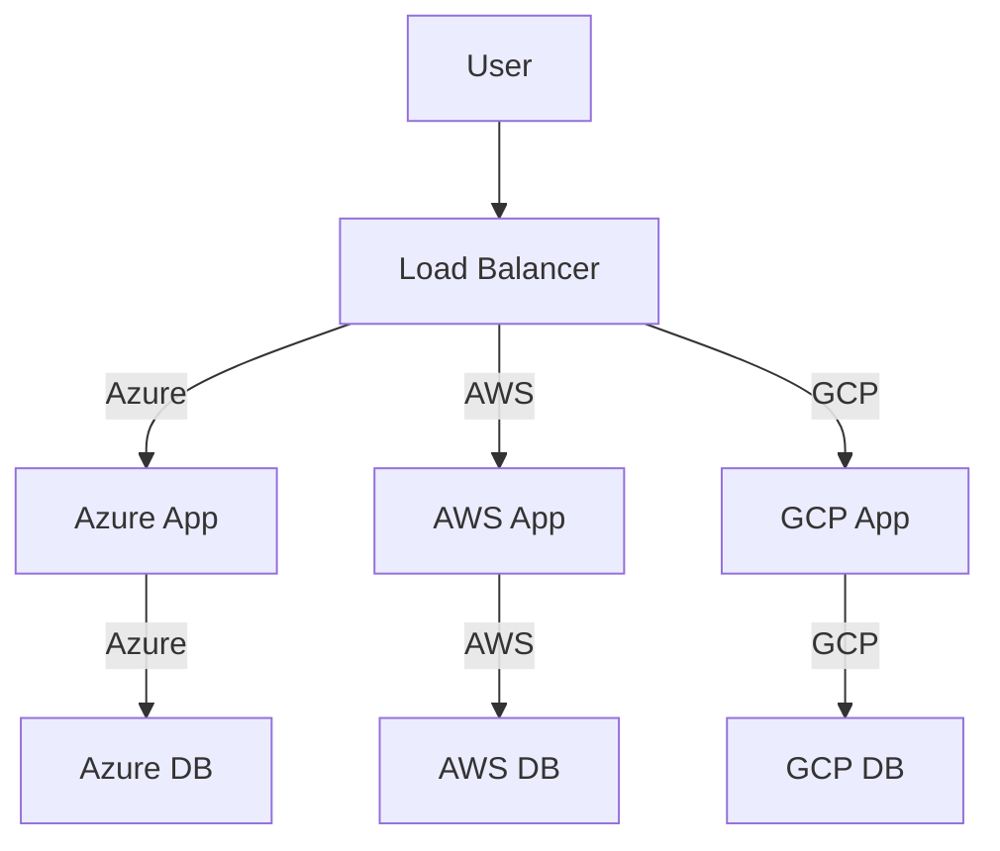

POC to build a simple web app using .NET 10 and Blazor, that distributed via multiple cloud service providers, and load balanced across them.

Multiple regions, multiple providers, multiple databases, multiple load balancers.

Will be need a way to sync data between databases, and a way to route traffic to the nearest database.

All as IAC using Terraform.

## Tech Stack

- .NET 10
- Blazor
- Docker
- Kubernetes
- Azure
- AWS
- GCP
- Nginx
- Terraform

## Architecture

